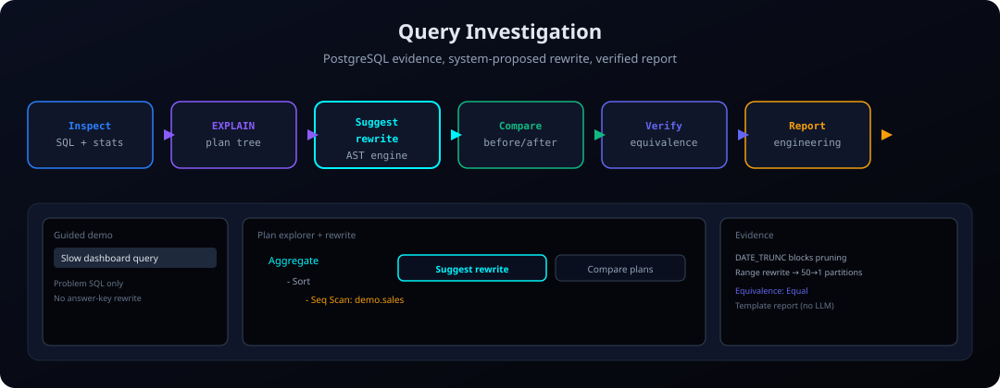

<p align="center">
  
</p>

<h1 align="center">PgQueryNarrative</h1>

<p align="center">
<strong>PostgreSQL query intelligence that shows its evidence</strong><br>
Investigate expensive queries, compare rewrites with plan proof,<br>
and ship engineering-ready reports.
</p>

<p align="center">
  <a href="https://github.com/pgquery-narrative/pgquerynarrative/actions"></a>
  
  
  
  <a href="https://github.com/pgquery-narrative/pgquerynarrative/pkgs/container/pgquerynarrative"></a>
  <a href="https://github.com/pgquery-narrative/pgquerynarrative/releases"></a>
  <a href=".github/SECURITY.md"></a>
</p>

<p align="center">
  <a href="#try-it-5-minutes"><strong>Try the demo</strong></a> ·
  <a href="docs/getting-started/connect-postgres.md">Connect your Postgres</a> ·
  <a href="docs/reference/deployment.md">Deploy</a> ·
  <a href="docs/index.md">Documentation</a> ·
  <a href=".github/SECURITY.md">Security</a>
</p>

<p align="center">
  
</p>

<p align="center"><sub>Investigate → compare rewrite with plan proof → engineering report.</sub></p>

---

## What it is

PgQueryNarrative is a **PostgreSQL investigation workbench**. The flagship loop is:

**expensive query → plan findings → candidate rewrite → measured compare → engineering report**

Safe read-only SQL and plan analysis are the core. An optional LLM can narrate; it is not required for investigation reports. Start with [Concepts](docs/concepts.md) if you want the vocabulary (evidence, EXPLAIN vs ANALYZE, what compare proves).

## Choose your path

| You want to… | Start here |
|--------------|------------|
| **Try it in ~5 minutes** | [Try it](#try-it-5-minutes) — `make demo` + guided Investigate |
| **Connect your PostgreSQL** | [Connect your Postgres](docs/getting-started/connect-postgres.md) — readonly role + schema allowlist |
| **Deploy** | [Deployment](docs/reference/deployment.md) — Docker / Compose / Kubernetes |
| **Understand trust & scope** | [Trust model](docs/trust-model.md) — what the app will and will not do |

---

## Try it (5 minutes)

Requires Docker. Starts Postgres + app + small seed (~2 minutes):

```bash
make demo
```

Open **http://localhost:8080**:

1. **Start guided demo** or open **Investigate**
2. Choose **Slow dashboard query**
3. Review the finding (e.g. `DATE_TRUNC` blocking partition pruning)
4. **Compare plans** on the range-predicate rewrite
5. **Generate report**

For README-scale partition counts (50→1 on ~10M rows):

```bash
make demo-bootstrap
```

`make demo` also starts **Ollama** and pulls `llama3.2` so **Ask in natural language** works locally (first run may download the model). Investigation still works if you skip the LLM.

More detail: [Quick start](docs/getting-started/quickstart.md)

---

## Trust model (short)

- User SQL runs as a **dedicated read-only role**, not the app migration user
- Schemas are **allowlisted** (`DATABASE_ALLOWED_SCHEMAS`, default `demo`)
- **Writes and DDL are blocked** in the query validator
- Cloud LLM row egress is **off unless you explicitly enable it**

Full write-up: [Trust model](docs/trust-model.md)

---

## Capabilities

| Area | What you get |
|------|----------------|
| **Query Investigation** | Findings from EXPLAIN, candidate compare, engineering report |
| **Secure read-only access** | Readonly pool, statement limits, timeouts, schema allowlist |
| **Plan analysis** | Seq-scan / cost findings; optional `EXPLAIN ANALYZE` when enabled |
| **Workbench** | Plan tree, compare table, regression inbox, Security & Trust page |
| **Scale demo** | Partitioned `demo.sales`; 10M-row seed — [Dataset](docs/DATASET.md) |

Optional narratives: [LLM setup](docs/getting-started/llm-setup.md) · library embed: [Embedded integration](docs/getting-started/embedded.md)

---

## Commands

| Action | Command |
|--------|---------|
| **Guided demo** | `make demo` |
| Guided demo + 10M-row seed | `make demo-bootstrap` |
| Start / stop stack | `make start-docker` / `make stop` |
| Migrate (Docker) | `make migrate-docker` |
| Seed 10M rows (Docker) | `make seed-large-docker` |
| Local app (Postgres already up) | `make start-local` |
| Build / test | `make build` / `make test` |
| CLI | `make cli CMD='query "SELECT * FROM demo.sales LIMIT 5"'` |

---

## Project structure

| Path | Purpose |
|------|---------|
| [`cmd/server`](cmd/server) | API, health/ready, SPA |
| [`app/`](app/) | Config, DB, query runner, investigations, LLM, reports |
| [`api/design/`](api/design/) | Goa API design → `api/gen/` |
| [`frontend/`](frontend/) | React workbench |
| [`docs/`](docs/index.md) | Documentation (preview: `make docs`) |
| [`pkg/narrative/`](pkg/narrative/) | Embeddable client |

---

## Documentation

Preview: **`make docs`** → http://localhost:8000

| Section | Links |
|---------|--------|
| **Start here** | [Docs overview](docs/index.md) · [Concepts](docs/concepts.md) · [Trust model](docs/trust-model.md) |
| **Getting started** | [Quick start](docs/getting-started/quickstart.md) · [Installation](docs/getting-started/installation.md) · [Connect Postgres](docs/getting-started/connect-postgres.md) · [LLM setup](docs/getting-started/llm-setup.md) |
| **Product** | [UI overview](docs/ui-overview.md) · [Configuration](docs/configuration.md) |
| **API** | [Reference](docs/api/README.md) · [Examples](docs/api/examples.md) |
| **Ops** | [Deployment](docs/reference/deployment.md) · [Operations](docs/reference/operations.md) · [Troubleshooting](docs/reference/troubleshooting.md) |
| **Develop** | [Setup](docs/development/setup.md) · [Testing](docs/development/testing.md) · [Dev runbook](docs/development/runbook.md) |
| **Evidence** | [Dataset](docs/DATASET.md) · [Case study](docs/case-studies/01-query-optimization.md) |

**Contributing & security:** [.github/CONTRIBUTING.md](.github/CONTRIBUTING.md) · [.github/SECURITY.md](.github/SECURITY.md) · **Changelog:** [CHANGELOG.md](CHANGELOG.md)

## Branches & releases

| Branch / tag | Purpose |
|--------------|---------|
| [`main`](https://github.com/pgquery-narrative/pgquerynarrative/tree/main) | Latest development |
| [`stable-v2.0.0`](https://github.com/pgquery-narrative/pgquerynarrative/tree/stable-v2.0.0) | v2 line — EXPLAIN, benchmark dataset, validation |
| [`stable-v1.0.0`](https://github.com/pgquery-narrative/pgquerynarrative/tree/stable-v1.0.0) | v1 line — earlier AI-narrative focus |
| Tag [`v2.0.0`](https://github.com/pgquery-narrative/pgquerynarrative/releases/tag/v2.0.0) | v2.0.0 release |

## License

MIT. See [LICENSE](LICENSE).
