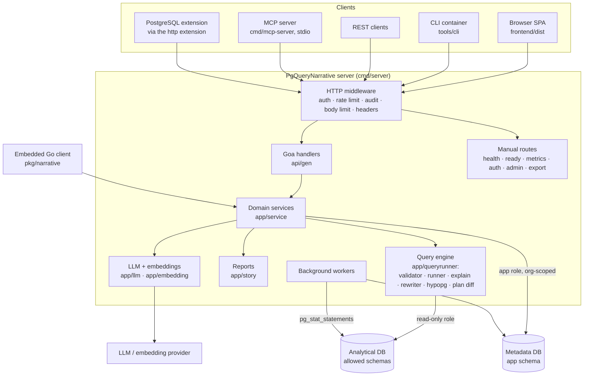
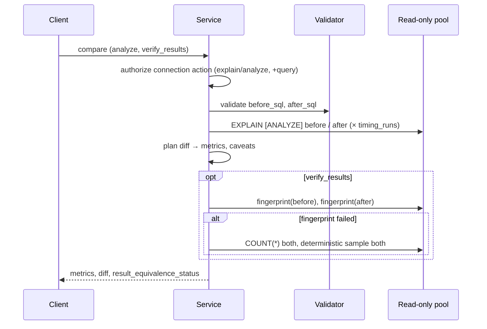
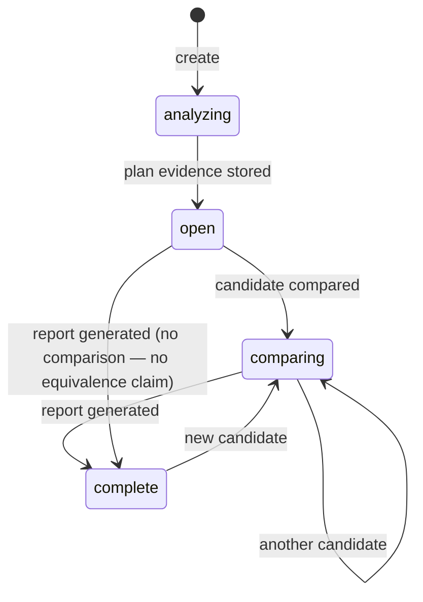
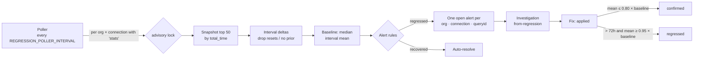

# Architecture

How PgQueryNarrative is built, which database identity touches what, and where each
guarantee is enforced. Code layout for contributors: [Repository architecture](development/repository.md).

## System overview

Every client except the embedded Go client goes through the HTTP server and the same
middleware. The MCP server and the PostgreSQL extension are thin HTTP clients of the REST
API — neither contains query logic. The embedded client (`pkg/narrative`) constructs the
same services in-process.

## Metadata database versus analytical database

| | Metadata database | Analytical database(s) |
|---|---|---|
| Holds | The `app` schema: organizations, users, API keys, sessions, saved queries, reports, investigations, regression snapshots and alerts, schedules, audit log, embeddings; `schema_migrations` | Your data, in the schemas you allowlist |
| Reached through | One app pool (`DATABASE_HOST`/`DATABASE_NAME`, `DATABASE_USER`), wrapped so every transaction sets the organization | One read-only pool per connection (`default`, `DATABASE_CONNECTIONS_JSON` entries, per-organization secrets) |
| Written by PgQueryNarrative | Yes — that is its job | No. The runtime role cannot write; the only session-level change is a `SET LOCAL transaction_read_only = off` inside the HypoPG projection transaction, which creates hypothetical indexes only and resets them |

The `default` connection is derived from `DATABASE_HOST`/`DATABASE_PORT`/`DATABASE_NAME`
with the read-only credentials, so out of the box both are **the same PostgreSQL
database reached as two different roles**. The read-only role has every privilege on
`app` and `public` revoked (migration `000043`), so user SQL cannot read metadata even
then. In production, point connections at a replica or a separate reporting database.

## Database identities

| Identity | Configured by | Used for | Lifetime |
|---|---|---|---|
| **Migration** | `DATABASE_MIGRATION_USER`/`_PASSWORD` or `DATABASE_MIGRATION_URL` | `migrate up` in the container entrypoint: creates extensions (`pg_stat_statements`, `vector`, `hypopg`) and runs `ALTER ROLE` | Entrypoint only; the variables are unset before the server process starts |
| **App** | `DATABASE_USER`/`DATABASE_PASSWORD` | All metadata reads and writes; `NOBYPASSRLS`, so organization policies apply to it | Server process |
| **Read-only** | `DATABASE_READONLY_USER`/`_PASSWORD`, or `readOnlyUser` per connection | Every user-supplied statement: run, EXPLAIN, compare, verification, `pg_stat_statements` reads | Server process, one pool per connection |

Privileges, grants and the CI check that enforces them: [Database roles](security/database-roles.md).

## Request paths

What executes on the analytical database for each operation:

| Operation | Endpoint | Executes the user's SQL? | Path |
|---|---|---|---|
| Run query | `POST /queries/run` | **Yes** | validate → read-only transaction → wrap in `LIMIT` → size/column caps → result (`execution_time_ms`) |
| EXPLAIN | `POST /queries/explain` | No | validate → `EXPLAIN (SETTINGS, FORMAT JSON)` in a read-only transaction → findings, `evidence_mode=estimated` |
| EXPLAIN ANALYZE | same, `"analyze": true` | **Yes** | requires `SECURITY_EXPLAIN_ANALYZE_ENABLED` and the connection's `analyze` permission → `EXPLAIN (ANALYZE, BUFFERS, SETTINGS, FORMAT JSON)` |
| Create investigation | `POST /investigations` | Only if `analyze` (falls back to estimate-only on error) | EXPLAIN → findings stored in metadata |
| Suggest rewrite | `POST /investigations/{id}/suggest-rewrite` | No — parse tree only | AST rules over source SQL and stored findings |
| Rank candidates | `POST /investigations/{id}/rank-candidates` | No (dry EXPLAIN); HypoPG creates hypothetical indexes only | EXPLAIN baseline and each rewrite; index DDL projected with HypoPG or a labelled heuristic |
| Compare | `POST /queries/explain/compare`, `POST /investigations/{id}/candidate` | Only under ANALYZE or `verify_results` | two plans → metrics/diff; optional `timing_runs` |
| Result verification | `verify_results: true` on the above | **Yes** — 2 aggregate queries, or 4 on the fallback path | requires the connection's `query` permission |
| Investigation report | `POST /investigations/{id}/report` | No | equivalence gate → deterministic template → stored |
| Workbench report | `POST /reports/generate` | **Yes** | run query → metrics → LLM narrative (deterministic fallback) → stored |

## Evidence model

| Kind | Where it comes from | Treat it as |
|---|---|---|
| Planner cost | `EXPLAIN` | An estimate in arbitrary units; never a speed ratio |
| Estimated rows | `EXPLAIN` | The planner's belief |
| Actual rows, loops, buffers | `EXPLAIN ANALYZE` | Observed, for this run |
| `planning_time_ms` | PostgreSQL | Observed planning time |
| `server_execution_time_ms` | PostgreSQL, ANALYZE only | Observed execution time for one run |
| `request_wall_time_ms` | Server clock | Network + planning + (under ANALYZE) execution; not a query timing |
| Median and spread | `timing_runs` 2–5 | Observed repeatability; when the spread is as large as the difference, the compare says so |
| Result equivalence | `verify_results` | Verification of the rows (or a sample), per the [five states](reference/evidence.md#result-equivalence) |
| Findings, rewrites, index DDL, rankings | Rules over the above | Generated recommendations for human review |

## Investigation lifecycle

Statuses are not guarded transitions — adding a candidate to a completed investigation
moves it back to `comparing`. The fix lifecycle is tracked separately (below).

## Regression detection and applied fixes

- The poller runs when both `REGRESSION_POLLER_ENABLED` and `SECURITY_STAT_STATEMENTS_ENABLED`
  are true. It takes a PostgreSQL advisory lock per (organization, connection), so replicas
  do not double-poll; there is no global leader.
- A query needs at least three baseline intervals before it can alert. Thresholds and
  impact tiers: [Regressions and applied fixes](workflows/regressions.md).
- `confirmed` and `regressed` are measurements, set only by the poller, and only for
  investigations linked to a regression alert.

## Security boundaries

| Boundary | Enforced by | Page |
|---|---|---|
| Only one read-only statement reaches the database | Parse-tree validator (`app/queryrunner/validator.go`): single `SELECT`/`WITH` (or `EXPLAIN (FORMAT JSON)` of one), no DML/DDL/utility nodes, no `SELECT INTO`, no row locks | [Query execution safety](security/query-safety.md) |
| No writes even if validation were bypassed | Read-only transaction **and** a role without write privileges; CI runs `tools/db/verify_security.sh` | [Database roles](security/database-roles.md) |
| Schema and function reach | Schema allowlist for tables and schema-qualified names; deny-list for side-effecting functions | [Query execution safety](security/query-safety.md) |
| Time and size | `statement_timeout`, lock and idle timeouts, row limit, result/cell/column caps | [Query execution safety](security/query-safety.md) |
| Who may call what | API keys, sessions, OIDC; roles `admin`/`analyst`/`viewer`; per-connection actions | [Authentication and roles](security/authentication.md) |
| Organization isolation | RLS on `app.*` keyed on `app.current_org_id`; connection assignments | [Organizations and tenancy](security/tenancy.md) |
| Data at rest and egress | AES-GCM sealing when a key is set; LLM egress flags; audit modes | [Data handling](security/data-handling.md) |

## Integrations

| Integration | Transport | Scope |
|---|---|---|
| [REST API](integrations/rest-api.md) | HTTP + JSON, OpenAPI 3 spec in `api/gen/http/` | Everything |
| [MCP server](integrations/mcp.md) | stdio → REST | Run, schema, saved queries, reports, Ask, explain-in-English |
| [PostgreSQL extension](integrations/postgres-extension.md) | SQL functions → `http` extension → REST | Run query, workbench report, list saved queries |
| [Embedded Go](integrations/embedded-go.md) | In-process | Client methods and four mountable routes |
| [LLM providers](integrations/llm.md) | Outbound HTTPS (or local Ollama) | Ask, chat, SQL explanation, workbench narratives |
| [Webhooks](workbench/schedules.md#webhook-delivery) | Outbound HTTPS, signed | Scheduled report delivery |

## Background processing

Started by `cmd/server` at boot:

| Worker | Runs when | Interval | Multi-replica safety |
|---|---|---|---|
| Regression poller (+ fix confirmation) | `REGRESSION_POLLER_ENABLED` and `SECURITY_STAT_STATEMENTS_ENABLED` | `REGRESSION_POLLER_INTERVAL` (15m) | Advisory lock per org × connection |
| Schedule runner | `SCHEDULE_RUNNER_ENABLED` | `SCHEDULE_RUNNER_INTERVAL` (1m) | `FOR UPDATE SKIP LOCKED` claims, 5-minute leases with heartbeat and expired-lease recovery |
| Webhook retry | with the schedule runner | backoff 30s doubling to 30m, 5 attempts, then dead-letter | `SKIP LOCKED` outbox claims |
| EXPLAIN snapshot retention | always | every 6h | Deletes older than `SECURITY_EXPLAIN_SNAPSHOT_RETENTION_DAYS` (90; 0 keeps forever) |
| Rate-limit bucket cleanup | distributed (PostgreSQL) limiter | every 10m | — |
| LLM budget reservation cleanup | always | every 5m | — |
| Buffered audit writer | `SECURITY_AUDIT_MODE=buffered` | queue of 1,000, replay every 30s | `SKIP LOCKED` replay |
