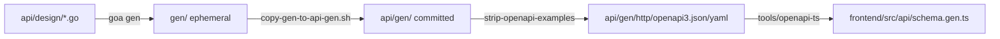

# Repository architecture

Where things live, and how a change flows from design to running code. Product
architecture (services, data flow, security boundaries): [Architecture](../architecture.md).

## Directories

| Path | Purpose |
|---|---|
| `cmd/server` | Entry point: wires config, pools, services, HTTP routes, background workers |
| `cmd/mcp-server` | The [MCP server](../integrations/mcp.md) binary |
| `cmd/pqn` | The `pqn` terminal tool. The logic is in `internal/pqncli` |
| `cmd/mockoidc`, `cmd/mockollama` | Local stand-ins for an IdP and an LLM, used by tests and Playwright |
| `api/design/` | Goa API design — the source of truth for the REST contract |
| `api/gen/` | Generated Goa code, **committed** (see [Code generation](#code-generation)) |
| `gen/` | Goa's own generation target, ephemeral — not the package the app imports |
| `app/` | Domain code: `config`, `db`, `auth`, `queryrunner`, `service`, `story`, `llm`, `embedding`, `security`, `audit`, `ratelimit`, `observability`, `httpmw`, `catalog`, `charts`, `metrics`, `errors`, `format` |
| `app/queryrunner` | The read-only validator, runner, EXPLAIN/plan analysis, rewrite engine, HypoPG, plan diff |
| `app/service` | Investigation, regression, schedule, report, and other domain services on top of `app/queryrunner` and `app/db` |
| `app/db/migrations` | golang-migrate SQL files, the metadata schema's source of truth |
| `pkg/narrative` | The embeddable Go client and HTTP middleware — see [Embedded Go](../integrations/embedded-go.md) |
| `web/` | Report HTML/PDF/Markdown/JSON/SQL export handlers |
| `frontend/` | React SPA (Vite, Tailwind, shadcn/ui); `frontend/src/api/schema.gen.ts` is generated |
| `infra/postgres-extension/` | The [REST-calling PostgreSQL extension](../integrations/postgres-extension.md) SQL |
| `infra/pqn-extension/` | The `pqn` extension: control file, version scripts and the role script. See [Install the pqn extension](../getting-started/pqn-installation.md) |
| `infra/postgres-init/` | Role/schema bootstrap SQL for a fresh database |
| `tools/` | Build and ops scripts: `db/` (seed, migrate, verify), `docker/` (entrypoint, images), `ops/` (backup, restore, Helm checks), `demo/`, `changelog/`, `openapi-ts/`, `openapi-strip-examples/`, `docscheck/` |
| `deploy/` | Docker Compose, Kubernetes manifests, Helm chart, Grafana dashboard, Prometheus alerts |
| `test/` | `unit/`, `integration/` (testcontainers), `e2e/`, `playwright/`, `load/` |
| `docs/` | This site |

## Code generation {#code-generation}

`make generate` runs the whole chain: Goa generation into the ephemeral `gen/`, a
patch/sync step into the committed `api/gen/`, stripping Goa's seeded request
examples (they carry no contract information and previously turned one field change
into a 55,000-line diff), then regenerating the frontend's TypeScript types from the
resulting OpenAPI 3 spec. **`app/` and `cmd/` import only `api/gen/`, never `gen/`.**

CI's `Lint` job re-runs `make generate` and fails the build if `api/gen/` or
`frontend/src/api/schema.gen.ts` differ from what's committed — the generated code
is a checked-in artifact, not a build step trusted to run identically everywhere.

## Metadata migrations, analytical access

Metadata schema changes are golang-migrate files under `app/db/migrations/`,
applied by a privileged migration identity — see
[Database roles](../security/database-roles.md). The analytical database has no
migrations at all; PgQueryNarrative only ever reads it, through the read-only
role(s) described on the same page.

## Testing layers

Unit (`test/unit/`, in-package tests, `pkg/narrative`) → integration
(`test/integration/`, real Postgres via testcontainers) → E2E
(`test/e2e/`, full HTTP API) → Playwright (`test/playwright/`, browser). Full
breakdown and commands: [Testing](testing.md).

## Release layers

A tagged push builds native binaries per platform, a signed container image, and
publishes both — see [Releases and versioning](../project/releases.md) for the exact
matrix and [RELEASING.md](https://github.com/pgquery-narrative/pgquerynarrative/blob/main/RELEASING.md)
for the pre-tag gate.

## See also

[Architecture](../architecture.md) · [Change workflows](change-workflows.md) ·
[Testing](testing.md) · [Adding a rewrite rule](rewrite-rules.md)
