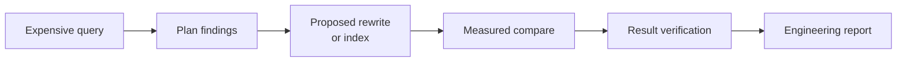

# PgQueryNarrative

PgQueryNarrative investigates PostgreSQL queries: it shows plan findings, proposes a
rewrite or index from the query's own parse tree, compares the plans, verifies that
the result rows match, and writes the evidence up as a report.



It does not apply a rewrite, index, or DDL statement to the database it investigates;
a person reviews and applies the change. User SQL runs through a dedicated read-only
role. See [Concepts](concepts.md) for vocabulary, [Architecture](architecture.md) for
the system map, and [Trust model](trust-model.md) for the security boundaries.

## Getting started

- [Quick start](getting-started/quickstart.md)
- [Installation](getting-started/installation.md)
- [Connect your PostgreSQL](getting-started/connect-postgres.md)
- [pqn: run from a terminal, no server](getting-started/pqn-extension.md)

## Query investigation

- [Investigate a slow query](workflows/investigate.md)
- [Understand plan findings](workflows/plan-findings.md)
- [Suggest and rank candidates](workflows/candidates.md)
- [Compare plans](workflows/compare.md)
- [Verify result equivalence](workflows/verify-results.md)
- [Regressions and applied fixes](workflows/regressions.md)

## Security and operations

- [Database roles](security/database-roles.md)
- [Query execution safety](security/query-safety.md)
- [Deployment](operate/deployment.md)
- [Production configuration](operate/production.md)

## Integrations

- [REST API](integrations/rest-api.md)
- [MCP server](integrations/mcp.md)
- [PostgreSQL extensions](integrations/postgres-extension.md)
- [LLM providers](integrations/llm.md)

## Development

- [Setup](development/setup.md)
- [Repository architecture](development/repository.md)
- [Testing](development/testing.md)

## Reference

Checked against the code by `make docs-contract-check`:
[configuration](reference/configuration.md), [API](reference/api.md),
[API errors](reference/api-errors.md), [status vocabulary](reference/evidence.md),
[CLI](reference/cli.md), [pqn](reference/pqn.md),
[versions and limits](reference/versions-limits.md).

## Local preview

```bash
make docs   # http://127.0.0.1:8000
```
