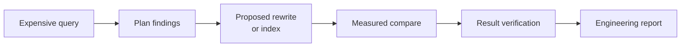

# What is PgQueryNarrative?

**PgQueryNarrative is a PostgreSQL investigation workbench: it takes an expensive
query, shows what the planner is doing, proposes a rewrite or index from the query's
own parse tree, measures the change, checks that the rewrite returns the same rows,
and writes the evidence up as an engineering report.**



It is not an autonomous optimizer. It proposes; a person reviews and applies. It
never applies a proposed rewrite, index or DDL to the database you point it at, and
it runs your SQL through a dedicated read-only role. The investigation loop needs no
LLM; an optional LLM adds natural-language Ask and narrative reports on top.

## Where to start

| You are… | Start with | Then |
|---|---|---|
| **Evaluating it** | [Quick start](getting-started/quickstart.md) — `make demo`, guided investigation | [Concepts](concepts.md) |
| **Investigating a real query** | [Connect your PostgreSQL](getting-started/connect-postgres.md) | [Investigate a slow query](workflows/investigate.md) |
| **A DBA reviewing access** | [Trust model](trust-model.md) | [Database roles](security/database-roles.md) · [Query execution safety](security/query-safety.md) |
| **Deploying it** | [Deployment](operate/deployment.md) | [Production configuration](operate/production.md) · [Health and monitoring](operate/monitoring.md) |
| **Integrating with it** | [REST API](integrations/rest-api.md) | [API reference](reference/api.md) · [MCP server](integrations/mcp.md) · [PostgreSQL extension](integrations/postgres-extension.md) |
| **Contributing** | [Development setup](development/setup.md) | [Repository architecture](development/repository.md) · [Testing](development/testing.md) |

## How the documentation is organised

| Section | Answers |
|---|---|
| **Overview** | What the product is, its vocabulary, how it is built, what it will and will not do. [Architecture](architecture.md) is the system map. |
| **Getting started** | Running it: the demo, installation, pointing it at your own database. |
| **Core workflows** | Task guides for the investigation loop — findings, candidates, compare, [result verification](workflows/verify-results.md), regressions and applied fixes, multiple connections. |
| **Workbench** | The UI surfaces around the loop: reports and sharing, dashboards, schedules and webhooks. |
| **Integrations** | Calling it from elsewhere: REST, MCP, SQL (extension), Go (embedded), LLM providers, pgvector. |
| **Security & access** | Roles, the SQL validator, authentication, organization isolation, data handling. |
| **Deploy & operate** | Docker/Kubernetes/Helm, production settings, probes and metrics, migrations and upgrades, runbooks. |
| **Reference** | Lookup tables checked against the code: [configuration](reference/configuration.md), [API](reference/api.md), [errors](reference/api-errors.md), [status vocabulary](reference/evidence.md), CLI, versions and limits. |
| **Development** | Repository layout, code generation, tests, and how to change the API, configuration or rewrite rules safely. |
| **Examples** | The measured case study, the demo dataset, and the demo-data RLS walkthrough. |
| **Project** | Releases, versioning, branch protection, contributing and the security policy. |

Reference pages are mechanically checked: `make docs-contract-check` fails when a
configuration variable, API operation, error code, release platform or the Go version
in the docs disagrees with the code.

## Local preview

```bash
make docs        # http://127.0.0.1:8000
make docs-check  # the strict build CI runs
```
