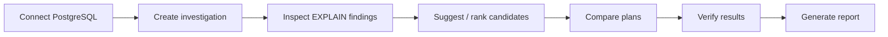

# Investigate a slow query

The end-to-end loop, and exactly what executes SQL along the way.



## 1. Connect PostgreSQL

Point a connection at the database that runs the slow query — the demo dataset, or
your own via [Connect your PostgreSQL](../getting-started/connect-postgres.md). Every
step below can target a non-default connection with `connection_id`; see
[Multiple connections](connections.md).

## 2. Create an investigation

```bash
curl -s -X POST http://localhost:8080/api/v1/investigations \
  -H "Content-Type: application/json" \
  -d '{"title": "Slow dashboard query", "sql": "..."}'
```

This runs `EXPLAIN` (not `ANALYZE`, unless you pass `"analyze": true` and the server
allows it) and stores the plan and findings on the investigation. If ANALYZE is
requested but fails, the investigation falls back to an estimate-only EXPLAIN rather
than failing the request.

## 3. Inspect plan findings

`GET /api/v1/investigations/{id}` returns `explain.findings` — see
[Understand plan findings](plan-findings.md) for what each finding kind means and
why planner cost is not a time.

## 4. Suggest or rank candidates

```bash
curl -s -X POST http://localhost:8080/api/v1/investigations/{id}/suggest-rewrite -d '{}'
```

This parses the source SQL's AST; **no SQL runs**. See
[Suggest and rank candidates](candidates.md) for the rule set, HypoPG, and why some
queries get findings but no rewrite.

## 5. Compare plans

```bash
curl -s -X POST http://localhost:8080/api/v1/investigations/{id}/candidate \
  -d '{"candidate_sql": "...", "analyze": true}'
```

Runs EXPLAIN (and ANALYZE, if allowed and requested) on both the source and candidate
SQL. See [Compare plans](compare.md).

## 6. Verify results

Add `"verify_results": true` to the candidate call above. This **executes both
queries** and requires the `query` permission on the connection. Read
[Verify result equivalence](verify-results.md) — it is the page that determines
whether a report can be generated at all.

## 7. Generate the report

```bash
curl -s -X POST http://localhost:8080/api/v1/investigations/{id}/report -d '{}'
```

No LLM involved: this is a deterministic template built from the stored evidence.
Once a candidate has been compared, generating a report requires equivalence
`VerifiedEqual`, or `SampleMatch` with `?accept_sample_match=true` — see the gate
rules on [Verify result equivalence](verify-results.md#the-report-gate). An
investigation with **no** comparison at all can still get a report; it simply carries
no equivalence claim.

## What executes SQL, at a glance

| Step | Executes analytical SQL? |
|---|---|
| Create (no `analyze`) | No |
| Create (`analyze: true`) | Yes, once |
| Suggest rewrite | No |
| Rank candidates (dry EXPLAIN) | No; HypoPG creates a hypothetical index only |
| Candidate / compare (no `analyze`, no `verify_results`) | No |
| Candidate / compare (`analyze: true`) | Yes, `timing_runs` times per side |
| Candidate / compare (`verify_results: true`) | Yes — 2 queries, or 4 on the fallback path |
| Report | No |

## See also

[Concepts](../concepts.md) · [REST API](../integrations/rest-api.md) ·
[Architecture — request paths](../architecture.md#request-paths) ·
[`pqn`](../getting-started/pqn-extension.md), the same investigation from a terminal against your database, with no PgQueryNarrative server
