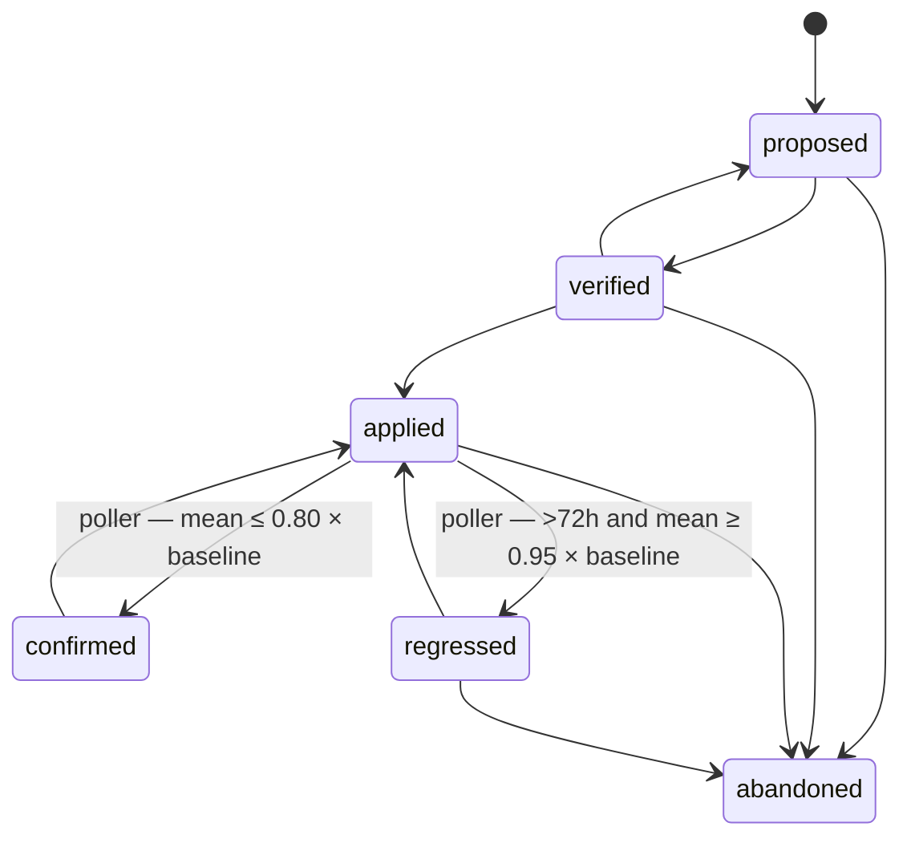

# Regressions and applied fixes

With `pg_stat_statements` available, PgQueryNarrative can notice a query getting
worse over time and turn that into an investigation. This page covers detection
through to the system confirming — or contradicting — a fix.

## Snapshot collection and baseline

A background poller (`REGRESSION_POLLER_ENABLED` and
`SECURITY_STAT_STATEMENTS_ENABLED`, both true by default when `pg_stat_statements`
is enabled) runs every `REGRESSION_POLLER_INTERVAL` (default 15m), once per
organization × connection that has the `stats` permission on that connection. It
takes a PostgreSQL advisory lock per (org, connection) so replicas of the server
don't double-poll — there is no separate leader election.

It skips a connection whose read-only role is shared by more than one organization
(logging one line): `pg_stat_statements` is kept per role, so polling would copy every
organization's SQL text into each organization's own tables. Give each organization its
own read-only credentials (`/admin/connection-secrets`) to poll it.

Each poll snapshots the top 50 statements by `total_time` (excluding the tool's own
traffic), computes the delta since the previous interval for each `queryid`, and
drops intervals with no prior snapshot or a negative delta (a stats counter reset).
The **baseline** for a query is the median interval mean latency, the p90 interval
total time, and the average calls and rows across its recorded intervals. A query
needs at least 3 baseline intervals before it is eligible to alert.

## Alert rules

An alert fires when, relative to baseline:

- mean latency is up by at least `REGRESSION_MEAN_THRESHOLD_PCT` (default 50%), or
- total time is up by at least 1.5× that threshold, or
- call volume is up by at least 200%, or
- rows returned per call changed by at least 80%

Impact tier: **critical** at ≥ `REGRESSION_CRITICAL_THRESHOLD_PCT` (200), **high** at
≥ `REGRESSION_HIGH_THRESHOLD_PCT` (100), otherwise **medium**. There is at most one
open alert per (organization, connection, `queryid`) — a second detection updates
the existing alert rather than creating a duplicate. An alert auto-resolves once the
mean change drops back to half the threshold, and acknowledgement is cleared
automatically if impact later escalates.

## From alert to investigation

```bash
curl -s -X POST http://localhost:8080/api/v1/investigations/from-regression \
  -d '{"regression_alert_id": "..."}'
```

This looks up the most recent snapshot SQL for that `queryid` on that connection and
opens (or reuses, if one already exists) an investigation with the alert linked. It
rejects a snapshot whose SQL text is empty or was truncated by
`pg_stat_statements.track` settings. From there the flow is the same as any other
investigation: [Investigate a slow query](investigate.md).

`GET /workspace/regressions` lists the inbox; `POST /workspace/regressions/{id}/acknowledge`
marks one seen. On the default `make demo` seed, the inbox is empty unless real
`pg_stat_statements` activity exists — set `APP_ENV=demo` for seeded demo alerts, and
never in an environment where the numbers are acted on.

## Fix lifecycle



`POST /investigations/{id}/fix` moves a fix between `proposed`, `verified`,
`applied` and `abandoned`. **`confirmed` and `regressed` cannot be set through the
API** — they are measurements, written only by the poller, and only for
investigations linked to a regression alert. Moving a fix to `applied` snapshots a
baseline for later comparison: the latest interval mean for the linked query, or the
raw snapshot mean if no interval baseline exists yet.

After that, on each poll the poller checks that connection's fixes marked `applied`:
mean latency at or below 80% of the applied-time baseline moves the fix to
`confirmed`; more than 72 hours since apply with the mean still at or above 95% of
baseline moves it to `regressed`. A fix applied to an investigation with no linked
regression alert stays `applied` indefinitely — there is no measurement path for it.

## See also

[Architecture — regression detection](../architecture.md#regression-detection-and-applied-fixes) ·
[Investigate a slow query](investigate.md) · [Multiple connections](connections.md)
